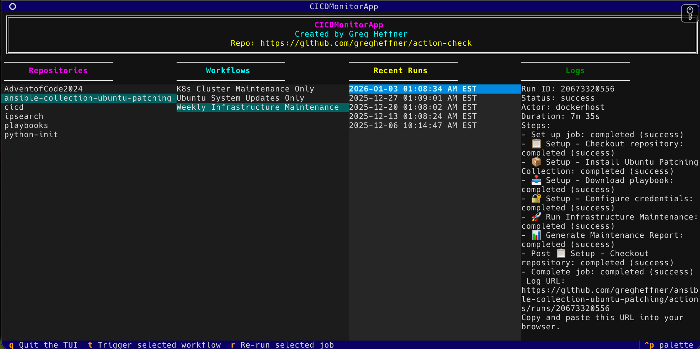

# GitHub Action TUI: Monitor & Trigger Workflows



A Textual-based Terminal User Interface (TUI) for monitoring and managing GitHub Actions workflows across your repositories.

## Features
- **Browse Repositories:** See all your GitHub repositories with Actions workflows.
- **View Workflows:** List and select workflows for each repository.
- **Monitor Runs:** See recent workflow runs, their status, and details.
- **Trigger Workflows:** Manually dispatch workflows from the TUI.
- **Re-run Jobs:** (UI only; logic stubbed) Option to re-run jobs.
- **Live Logs:** View logs and status updates in real time.
- **Keyboard Navigation:**
  - Left/Right arrows: Move between columns
  - Up/Down arrows: Navigate lists
  - `t`: Trigger selected workflow
  - `r`: Re-run selected job
  - `q`: Quit

## Requirements
- Python 3.8+
- [Textual](https://github.com/Textualize/textual)
- [httpx](https://www.python-httpx.org/)
- [python-dotenv](https://github.com/theskumar/python-dotenv)

Install dependencies:
```bash
pip install -r requirements.txt
```

## Setup
1. **GitHub Token:**
   - Create a `.env` file in the project root with:
     ```
     GITHUB_TOKEN=ghp_yourgithubtokenhere
     ```
   - The token must have `repo` and `workflow` scopes.

2. **Run the TUI:**
   ```bash
   python action-check.py
   ```

## Security
- Your `.env` and token are ignored by git via `.gitignore`.
- No sensitive data is uploaded to GitHub.

## License
MIT

---
*Built with [Textual](https://github.com/Textualize/textual) for a modern terminal experience.*
